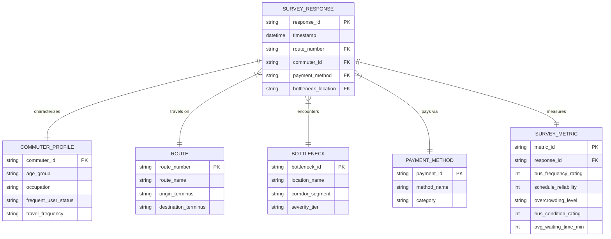
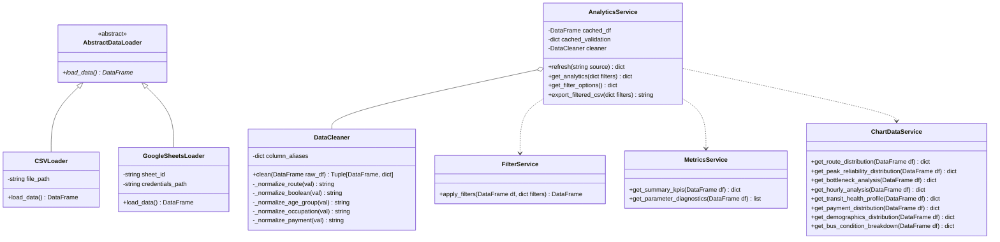
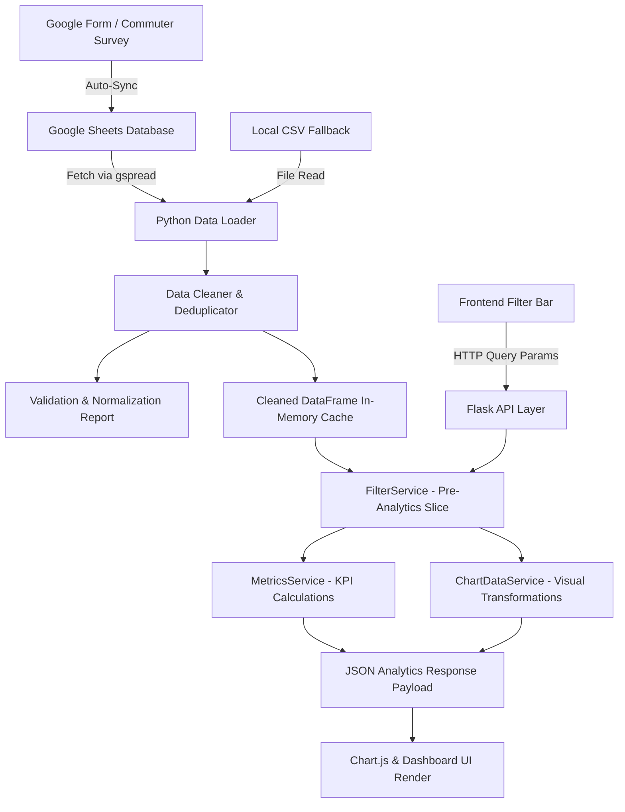
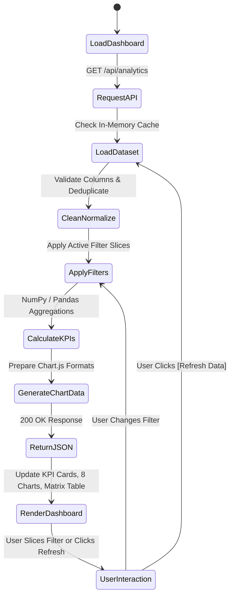
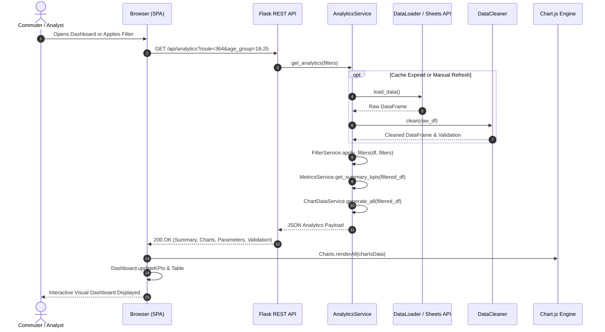

# Chapter 3: Methodology & Architectural Modeling

## 3.1 Logical ER Model
In accordance with modern analytical data engineering (OLAP/survey analysis), the logical schema organizes survey observations into analytical entities without needing an RDBMS:

## 3.2 Class Diagram
The object-oriented design of the Python analytics engine:

## 3.3 System Flowchart

## 3.4 Activity Diagram

## 3.5 Sequence Diagram

