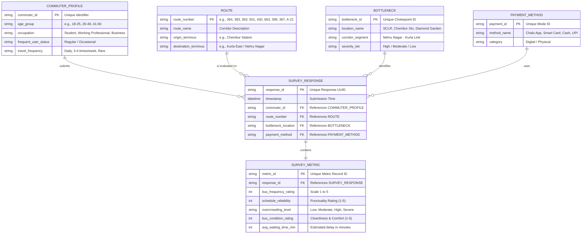
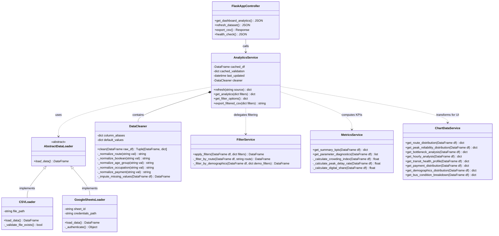
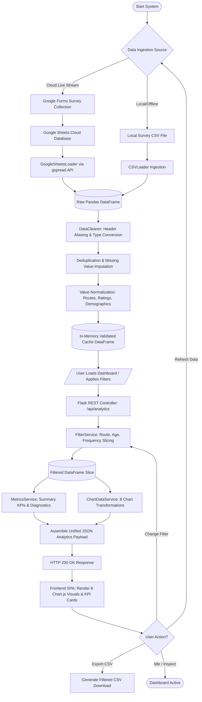
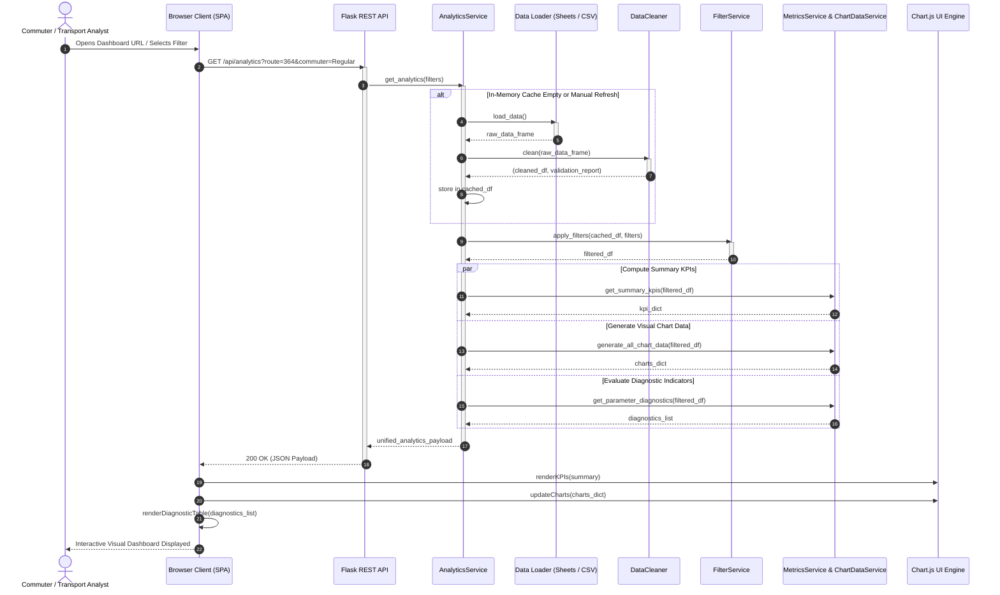

# Chapter 3: Methodology & Design Documentation

## Project: BEST Bus Transit Insights & Analytics System

---

## 3.1 Entity-Relationship (ER) Diagram

### Description
The Logical Entity-Relationship (ER) Diagram models the relational structure of the survey data repository and analytical dimensions. The schema organizes survey submissions across 5 distinct entities: **Commuters**, **Bus Routes**, **Bottleneck Locations**, **Payment Methods**, and **Survey Metrics**.



---

## 3.2 Class Diagram

### Description
The Object-Oriented Class Diagram illustrates the backend architecture of the Python/Flask analytics microservice, showcasing data ingestion abstractions, data validation, filtering services, statistical aggregation, and REST API controllers.



---

## 3.3 Flow Chart (System Process Pipeline)

### Description
The Flow Chart outlines the sequential processing pipeline from commuter data acquisition to interactive visualization and reporting.



---

## 3.4 Activity Diagram (UML Behavioral Flow)

### Description
The UML Activity Diagram details user interactions, system validations, parallel processing threads, and backend state transitions during dashboard operations.

```mermaid
stateDiagram-v2
    [*] --> InitializeDashboard : User opens Web Browser
    
    InitializeDashboard --> FetchInitialData : Dispatch GET /api/analytics
    
    state FetchInitialData {
        [*] --> CheckCache
        CheckCache --> ServeCache : Cache Valid & Warm
        CheckCache --> ReadDataSource : Cache Cold / Expired
        ReadDataSource --> CleanAndValidate : Load CSV or Sheets
        CleanAndValidate --> StoreCache : Update In-Memory Cache
        StoreCache --> ServeCache
        ServeCache --> [*]
    }
    
    FetchInitialData --> ApplyActiveFilters
    
    state ProcessAnalytics {
        [*] --> ParallelProcessing
        state ParallelProcessing {
            -->> ComputeKPIs : Calculate Delay, Crowding, Digital Share
            -->> ComputeCharts : Format 8 Datasets (Bar, Line, Radar, Donut)
            -->> ComputeDiagnostics : Evaluate Sentiment & Concern Tags
        }
        ParallelProcessing --> AggregateResponse
        AggregateResponse --> [*]
    }
    
    ApplyActiveFilters --> ProcessAnalytics
    ProcessAnalytics --> TransmitJSONPayload : HTTP 200 Response
    
    state UI_Rendering {
        [*] --> RenderCards : Update KPI Banner
        [*] --> RenderCharts : Update Chart.js Canvas
        [*] --> RenderMatrix : Populate Diagnostic Table
    }
    
    TransmitJSONPayload --> UI_Rendering
    
    UI_Rendering --> AwaitingUserInput : Dashboard Ready
    
    AwaitingUserInput --> SlicingData : User Adjusts Filter (Route / Age / Occupation)
    SlicingData --> ApplyActiveFilters
    
    AwaitingUserInput --> ManualRefresh : User clicks "Refresh Data"
    ManualRefresh --> ReadDataSource
    
    AwaitingUserInput --> DownloadCSV : User clicks "Export CSV"
    DownloadCSV --> GenerateFile : Stream CSV Buffer
    GenerateFile --> AwaitingUserInput
```

---

## 3.5 Sequence Diagram (System Interaction Timeline)

### Description
The UML Sequence Diagram captures the chronological message exchange between the commuter/analyst, Single Page Application frontend, Flask REST API layer, business logic services, and the data stores.


