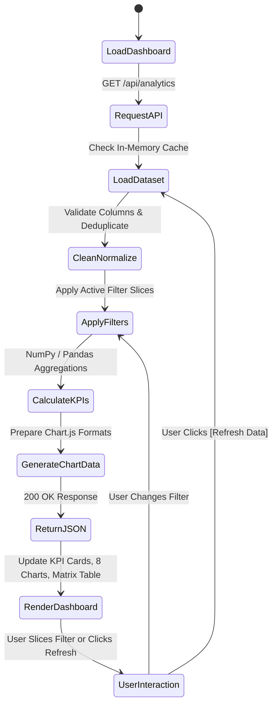

# Activity Diagram

State transitions and operational sequence during dashboard usage:

```mermaid
stateDiagram-v2
    [*] --> LoadDashboard
    LoadDashboard --> RequestAPI : GET /api/analytics
    RequestAPI --> LoadDataset : Check In-Memory Cache
    LoadDataset --> CleanNormalize : Validate Columns & Deduplicate
    CleanNormalize --> ApplyFilters : Apply Active Filter Slices
    ApplyFilters --> CalculateKPIs : NumPy / Pandas Aggregations
    CalculateKPIs --> GenerateChartData : Prepare Chart.js Formats
    GenerateChartData --> ReturnJSON : 200 OK Response
    ReturnJSON --> RenderDashboard : Update KPI Cards, 8 Charts, Matrix Table
    RenderDashboard --> UserInteraction : User Slices Filter or Clicks Refresh
    UserInteraction --> ApplyFilters : User Changes Filter
    UserInteraction --> LoadDataset : User Clicks [Refresh Data]
```
