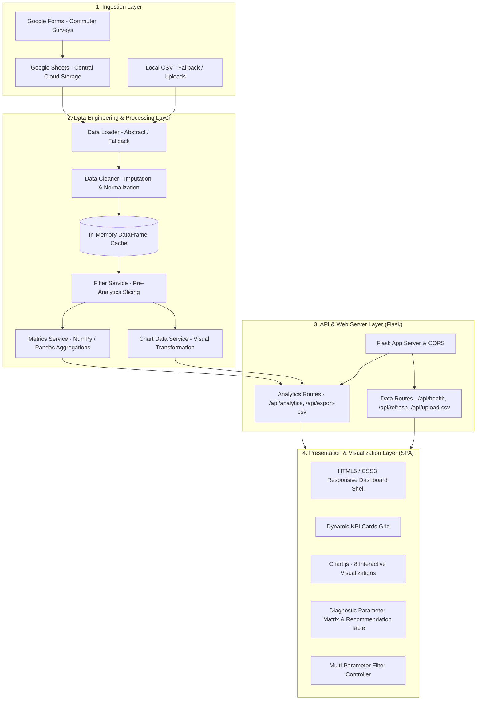

# System Architecture

High-level layered architecture of BEST Bus Transit Insights:

```mermaid
graph TB
    subgraph Ingestion["1. Ingestion Layer"]
        GF[Google Forms - Commuter Surveys]
        GS[Google Sheets - Central Cloud Storage]
        CSV[Local CSV - Fallback / Uploads]
    end

    subgraph DataEngineering["2. Data Engineering & Processing Layer"]
        DL[Data Loader - Abstract / Fallback]
        DC[Data Cleaner - Imputation & Normalization]
        CACHE[(In-Memory DataFrame Cache)]
        FS[Filter Service - Pre-Analytics Slicing]
        MS[Metrics Service - NumPy / Pandas Aggregations]
        CDS[Chart Data Service - Visual Transformation]
    end

    subgraph BackendAPI["3. API & Web Server Layer (Flask)"]
        APP[Flask App Server & CORS]
        ROUTEDATA[Data Routes - /api/health, /api/refresh, /api/upload-csv]
        ROUTEANALYTICS[Analytics Routes - /api/analytics, /api/export-csv]
    end

    subgraph Presentation["4. Presentation & Visualization Layer (SPA)"]
        SHELL[HTML5 / CSS3 Responsive Dashboard Shell]
        KPI[Dynamic KPI Cards Grid]
        CHARTJS[Chart.js - 8 Interactive Visualizations]
        TABLE[Diagnostic Parameter Matrix & Recommendation Table]
        FILTERS[Multi-Parameter Filter Controller]
    end

    GF --> GS
    GS --> DL
    CSV --> DL
    DL --> DC
    DC --> CACHE
    CACHE --> FS
    FS --> MS
    FS --> CDS
    MS --> ROUTEANALYTICS
    CDS --> ROUTEANALYTICS
    APP --> ROUTEDATA
    APP --> ROUTEANALYTICS
    ROUTEANALYTICS --> Presentation
    ROUTEDATA --> Presentation
```
