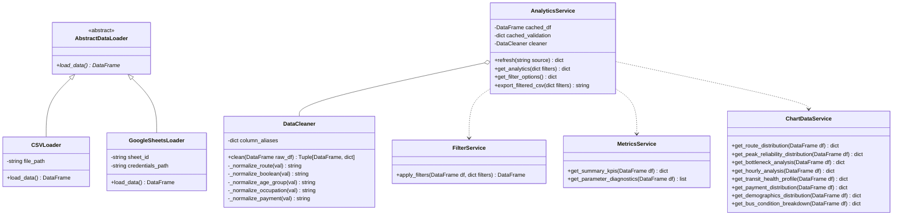

# Class Diagram

Object-oriented architecture of the Python/Pandas analytics pipeline:

```mermaid
classDiagram
    class AbstractDataLoader {
        <<abstract>>
        +load_data() DataFrame*
    }
    class CSVLoader {
        -string file_path
        +load_data() DataFrame
    }
    class GoogleSheetsLoader {
        -string sheet_id
        -string credentials_path
        +load_data() DataFrame
    }
    class DataCleaner {
        -dict column_aliases
        +clean(DataFrame raw_df) Tuple[DataFrame, dict]
        -_normalize_route(val) string
        -_normalize_boolean(val) string
        -_normalize_age_group(val) string
        -_normalize_occupation(val) string
        -_normalize_payment(val) string
    }
    class FilterService {
        +apply_filters(DataFrame df, dict filters) DataFrame
    }
    class MetricsService {
        +get_summary_kpis(DataFrame df) dict
        +get_parameter_diagnostics(DataFrame df) list
    }
    class ChartDataService {
        +get_route_distribution(DataFrame df) dict
        +get_peak_reliability_distribution(DataFrame df) dict
        +get_bottleneck_analysis(DataFrame df) dict
        +get_hourly_analysis(DataFrame df) dict
        +get_transit_health_profile(DataFrame df) dict
        +get_payment_distribution(DataFrame df) dict
        +get_demographics_distribution(DataFrame df) dict
        +get_bus_condition_breakdown(DataFrame df) dict
    }
    class AnalyticsService {
        -DataFrame cached_df
        -dict cached_validation
        -DataCleaner cleaner
        +refresh(string source) dict
        +get_analytics(dict filters) dict
        +get_filter_options() dict
        +export_filtered_csv(dict filters) string
    }

    AbstractDataLoader <|-- CSVLoader
    AbstractDataLoader <|-- GoogleSheetsLoader
    AnalyticsService o-- DataCleaner
    AnalyticsService ..> FilterService
    AnalyticsService ..> MetricsService
    AnalyticsService ..> ChartDataService
```
