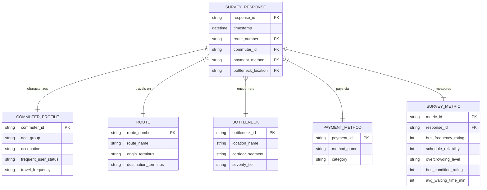

# Logical ER Diagram

The survey analytics logical data model organizes raw survey observations into structured analytical entities:

```mermaid
erDiagram
    SURVEY_RESPONSE {
        string response_id PK
        datetime timestamp
        string route_number FK
        string commuter_id FK
        string payment_method FK
        string bottleneck_location FK
    }
    COMMUTER_PROFILE {
        string commuter_id PK
        string age_group
        string occupation
        string frequent_user_status
        string travel_frequency
    }
    ROUTE {
        string route_number PK
        string route_name
        string origin_terminus
        string destination_terminus
    }
    BOTTLENECK {
        string bottleneck_id PK
        string location_name
        string corridor_segment
        string severity_tier
    }
    PAYMENT_METHOD {
        string payment_id PK
        string method_name
        string category
    }
    SURVEY_METRIC {
        string metric_id PK
        string response_id FK
        int bus_frequency_rating
        int schedule_reliability
        string overcrowding_level
        int bus_condition_rating
        int avg_waiting_time_min
    }

    SURVEY_RESPONSE ||--|| COMMUTER_PROFILE : "characterizes"
    SURVEY_RESPONSE }|--|| ROUTE : "travels on"
    SURVEY_RESPONSE }|--|| BOTTLENECK : "encounters"
    SURVEY_RESPONSE }|--|| PAYMENT_METHOD : "pays via"
    SURVEY_RESPONSE ||--|| SURVEY_METRIC : "measures"
```
