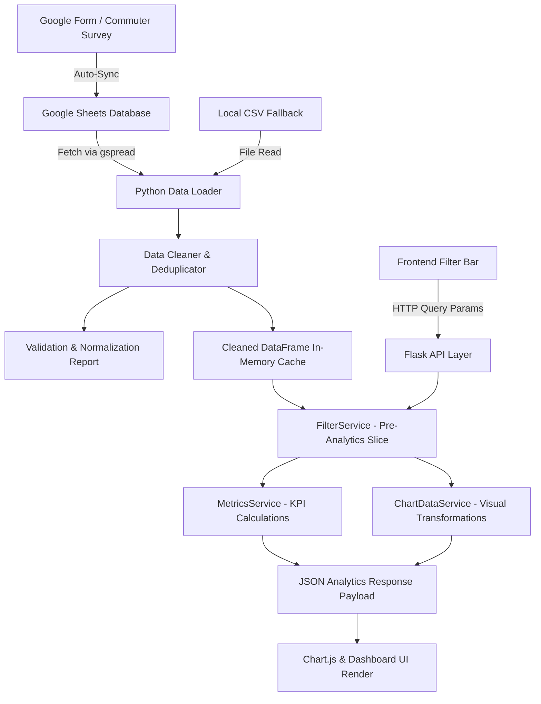

# System Flowchart

Pipeline flowchart from survey ingestion through dashboard visualization:

```mermaid
flowchart TD
    A[Google Form / Commuter Survey] -->|Auto-Sync| B[Google Sheets Database]
    B -->|Fetch via gspread| C[Python Data Loader]
    D[Local CSV Fallback] -->|File Read| C
    C --> E[Data Cleaner & Deduplicator]
    E --> F[Validation & Normalization Report]
    E --> G[Cleaned DataFrame In-Memory Cache]
    H[Frontend Filter Bar] -->|HTTP Query Params| I[Flask API Layer]
    I --> J[FilterService - Pre-Analytics Slice]
    G --> J
    J --> K[MetricsService - KPI Calculations]
    J --> L[ChartDataService - Visual Transformations]
    K --> M[JSON Analytics Response Payload]
    L --> M
    M --> N[Chart.js & Dashboard UI Render]
```
