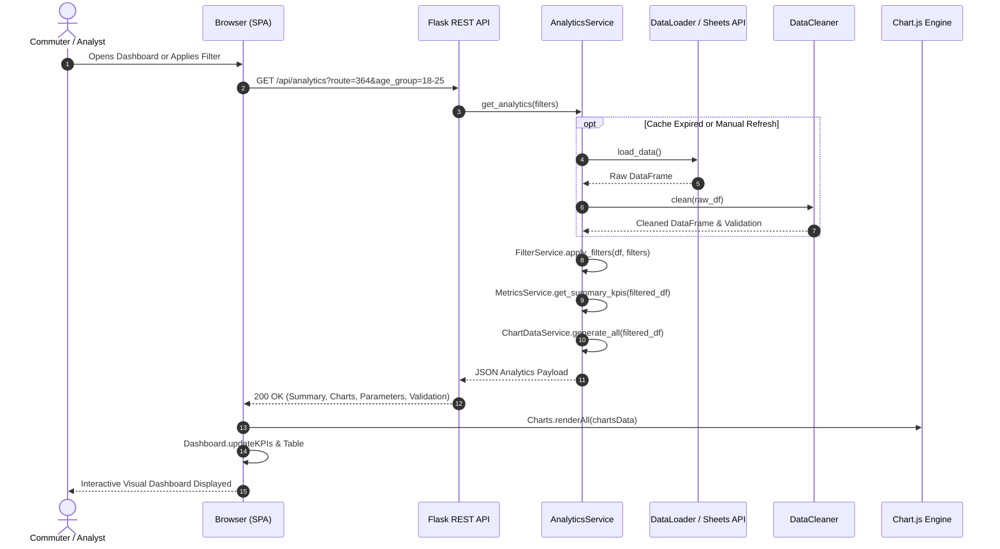

# Sequence Diagram

Interaction timeline between User, UI, Flask API, Services, and Visualizations:

```mermaid
sequenceDiagram
    autonumber
    actor User as Commuter / Analyst
    participant UI as Browser (SPA)
    participant Flask as Flask REST API
    participant Analytics as AnalyticsService
    participant Loader as DataLoader / Sheets API
    participant Cleaner as DataCleaner
    participant Charts as Chart.js Engine

    User->>UI: Opens Dashboard or Applies Filter
    UI->>Flask: GET /api/analytics?route=364&age_group=18-25
    Flask->>Analytics: get_analytics(filters)
    opt Cache Expired or Manual Refresh
        Analytics->>Loader: load_data()
        Loader-->>Analytics: Raw DataFrame
        Analytics->>Cleaner: clean(raw_df)
        Cleaner-->>Analytics: Cleaned DataFrame & Validation
    end
    Analytics->>Analytics: FilterService.apply_filters(df, filters)
    Analytics->>Analytics: MetricsService.get_summary_kpis(filtered_df)
    Analytics->>Analytics: ChartDataService.generate_all(filtered_df)
    Analytics-->>Flask: JSON Analytics Payload
    Flask-->>UI: 200 OK (Summary, Charts, Parameters, Validation)
    UI->>Charts: Charts.renderAll(chartsData)
    UI->>UI: Dashboard.updateKPIs & Table
    UI-->>User: Interactive Visual Dashboard Displayed
```
